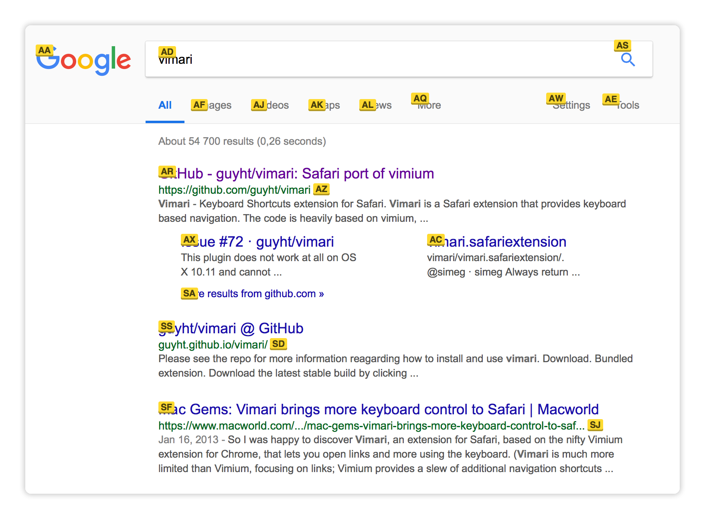

</img>

## Vimari
_Keyboard Shortcuts extension for Safari_

Vimari is a Safari extension that provides keyboard based navigation.
The code is heavily based on [vimium](https://github.com/philc/vimium), a
Chrome extension that provides much more extensive features.

Vimari attempts to provide a lightweight port of vimium to Safari, taking the
best components of vimium and adapting them to Safari.

</img>

## Releases

### Safari 12 and above

### Safari 11 and below (DEPRECATED)
 - [v1.13](https://github.com/guyht/vimari/releases/tag/v1.13)
 - [v1.12](https://github.com/guyht/vimari/releases/tag/v1.12)
 - [v1.11](https://github.com/guyht/vimari/releases/tag/v1.11)
 - [v1.10](https://github.com/guyht/vimari/releases/tag/v1.10)
 - [v1.9](https://github.com/guyht/vimari/releases/tag/v1.9)

## Installation

### Safari 12 and above (macOS Mojave or above)

#### Mac App Store

1. [Download Vimari](https://apps.apple.com/us/app/vimari/id1480933944?ls=1&mt=12) for free from the Mac App Store
2. Launch Vimari.app
3. Click "Open in Safari Extensions Preferences", Safari's Extension Preferences should open
4. Make sure that the checkbox for the Vimari extension is ticked
5. Go back to Vimari.app and press the reload button to check the status of the app. If it says "Enabled" then it is ready.
6. You may need to relaunch Safari for the extension to work

#### Prebuilt binaries

1. Download the [latest version](https://github.com/guyht/vimari/releases/latest) of Vimari
2. Unzip it
3. Move it to your `/Applications` folder
4. Launch Vimari.app
5. Click "Open in Safari Extensions Preferences...", Safari's Extension Preferences should open
6. Make sure that the checkbox for the Vimari extension is ticked
7. Go back to Vimari.app and press the reload button to check the status of the app. If it says "Enabled" then it is ready.
8. You may need to relaunch Safari for the extension to work

### Safari 11 (legacy Safari Extension method)

[Download the Vimari 1.13](https://github.com/guyht/vimari/releases/tag/v1.13) and double-click
the file.

## Usage

### Settings
**Modifier** - Modifier key to hold down with your action key. If
you leave it blank you don't need to hold down anything (default
setting).

**Excluded URLs** - Comma separated list of website URLs you don't want
to use vimari with. To exclude GitHub for example, provide the value
`github.com` or `http://github.com`. It's smart and should handle all
possible domain cases.

**Link Hint Characters** - Allowed characters to be used when generating
link shortcuts.

**Extra detection by cursor style** - Detect clickable links by looking
for HTML elements having cursor style set to "pointer".

**Scroll Size** - How much each scroll will move on the page.

`Vimari v2.1+`

**Smooth Scroll** - Scroll smoothly through the page.

 **Normal vs Insert mode** - Isolate website keybindings from the
Vimari keybindings. In normal mode you can use the Vimari keybindings
while in insert mode you can use the websites own keybindings.

**Transparent Bindings** - Full keybinding isolation might not
be your style, instead the transparent bindings setting (when enabled)
allows you to use all **non-Vimari-bound** keys to interact with the web
page as if you were in insert mode.

### Keyboard Bindings

These bindings are the ones set by default, however you are able to change them in the settings.

#### In-page navigation
    f       Toggle links
    F       Toggle links (open link in new tab)
    k       Scroll up
    j       Scroll down
    h       Scroll left
    l       Scroll right
    u       Scroll up half page
    d       Scroll down half page
    g g     Go to top of page
    G       Go to bottom of page
    g i     Go to first input

#### Page/Tab navigation
    H       History back
    L       History forward
    r       Reload
    w       Next tab
    q       Previous tab
    x       Close current tab
    t       Open new tab

`Vimari v2.1+`

#### Vimari Modes
    i       Enter insert mode
    ESC     Enter normal mode
    CTRL+[  Enter normal mode
    
### Tips & Tricks

Vimari is built as a Safari Extension, this poses some limits on what is possible through the extension. However default Safari shortcuts can help you keep your hands at the keyboard. Some helpful ones are listed here:

- **Focus URL Bar** <kbd>⌘</kbd><kbd>l</kbd> - This is a feature not available in Vimari, it is also helpful where extensions are not loaded (for example on `topsites://`). By focusing the URL Bar you can go to a website where the extension is loaded.

- **Reader mode** <kbd>⇧</kbd><kbd>⌘</kbd><kbd>R</kbd> - Currently Vimari does not support entering Reader mode (due to API limitations), also navigation inside reader mode (for example using <kbd>j</kbd> or <kbd>k</kbd>) is not supported.

- **Re-open last closed tab** <kbd>⇧</kbd><kbd>⌘</kbd><kbd>T</kbd> - Allows you to reopen a recently closed tab.

## License

Copyright (C) 2011 Guy Halford-Thompson. See [LICENSE](LICENSE) for details.
